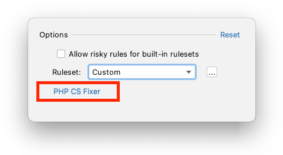
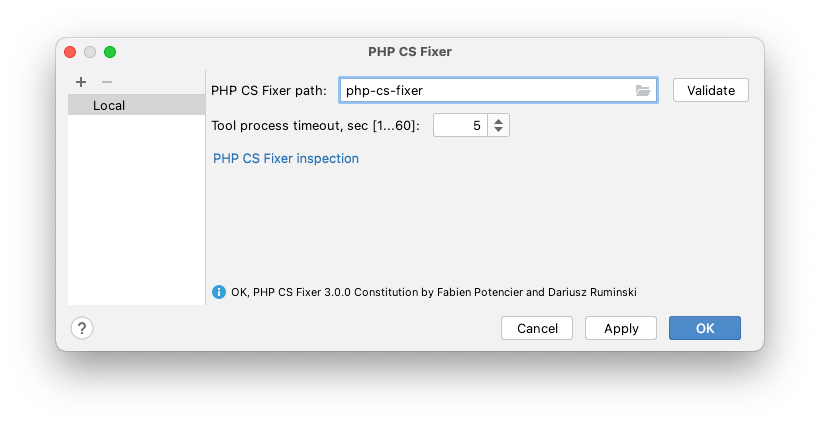

# PHP-CS-Fixer Configuration

[](https://packagist.org/packages/romanzipp/php-cs-fixer-config)
[](https://packagist.org/packages/romanzipp/php-cs-fixer-config)
[](https://packagist.org/packages/romanzipp/php-cs-fixer-config)
[](https://github.com/romanzipp/PHP-CS-Fixer-Config/actions)

Personal [PHP-CS-Fixer](https://github.com/FriendsOfPHP/PHP-CS-Fixer) wrapper & preset management.

## Installation

```
composer require romanzipp/php-cs-fixer-config --dev
```

## Usage

```php
return romanzipp\Fixer\Config::make()
    ->in(__DIR__)
    ->preset(
        new romanzipp\Fixer\Presets\PrettyLaravel()
    )
    ->out();
```

### Available Presets

- [**PrettyPHP**](src/Presets/PrettyPHP.php)
- [**PrettyLaravel**](src/Presets/PrettyLaravel.php) (extends [PrettyPHP](src/Presets/PrettyPHP.php))

### Exclude files or directories

```php
return romanzipp\Fixer\Config::make()
    // ...
    ->exclude([
        'wordpress.php',
    ])
    ->excludeDirectories([
        'wp',
    ])
    // ...
    ->out();
```

### Access the config and finder instances

```php
return romanzipp\Fixer\Config::make()
    // ...
    ->finderCallback(static function (PhpCsFixer\Finder $finder): void {
        // ...
    })
    ->configCallback(static function (PhpCsFixer\Config $config): void {
        // ...
    })
    // ...
    ->out();
```

## PHPStorm Configuration

### Prequisites

You will need to install PHP CS Fixer globally on your system because PHPStorm [does not allow](https://youtrack.jetbrains.com/issue/WI-56557) you to set the php-cs-fixer executable on a per-project basis or relative to the project path.

```shell
composer global require friendsofphp/php-cs-fixer
```
### 1. Enable Inspection


### 2. Select ruleset .php-cs-fixer.dist.php file `[...]`


Unfortunately you have to repeat this process for every project since [there is a bug in PHPStorm](https://youtrack.jetbrains.com/issue/WI-56557) which prevents users from using relative paths for the `.php-cs-fixer.dist.php` configuration or executable file.

Another theoretical approach to this issue is to create a unified ruleset file in your users .composer folder. This has the downside on only having one single ruleset.

### 3. Navigate to Quality Tools by clicking on the "PHP CS Fixer" link



### 4. Select PHP-CS-Fixer executable


